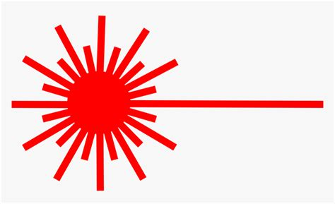

<div id="top"></div>


<br />
<div align="center">
  

  <h3 align="center">Laser Program Generator</h3>

  <p align="center">
    A program-generator for a primitive (and fictional) laser cutter machine
    <br />
    <br />
    <br />
  </p>
</div>


<!-- TABLE OF CONTENTS -->
<details>
  <summary>Table of Contents</summary>
  <ol>
    <li>
      <a href="#about-the-project">About The Project</a>
      <ul>
        <li><a href="#built-with">Built With</a></li>
      </ul>
    </li>
    <li>
      <a href="#getting-started">Getting Started</a>
      <ul>
        <li><a href="#prerequisites">Prerequisites</a></li>
        <li><a href="#installation">Installation</a></li>
      </ul>
    </li>
    <li><a href="#usage">Usage</a></li>
    <li><a href="#roadmap">Roadmap</a></li>
    <li><a href="#contact">Contact</a></li>
    <li><a href="#acknowledgments">Acknowledgments</a></li>
  </ol>
</details>


<!-- ABOUT THE PROJECT -->
## About The Project


### Built With

* [Typer](https://typer.tiangolo.com/)
* :heart:

<p align="right">(<a href="#top">back to top</a>)</p>


<!-- GETTING STARTED -->
## Getting Started

To get a local copy up and running follow these simple example steps.

### Prerequisites

* [Pip](https://pip.pypa.io/en/stable/installation/)

    or

* [Pipx](https://github.com/pypa/pipx)

### Installation

1. Clone the repo or download the .whl file directly
   ```sh
   git clone https://github.com/dyerjos/AutomationChallenge.git
   ```
2. Install pip package

    ```shell
    pip install --user <path to your laser-program-generator .whl file>
    ```

    or
    ```shell
    pipx install <path to your laser-program-generator .whl file>
    ```

<p align="right">(<a href="#top">back to top</a>)</p>


<!-- USAGE EXAMPLES -->
## Usage

  ```shell
  $ laser-program-generator generate-program <your output pattern string>
  ```

  your string should look like this:

    """
    ..XXX..
    XX...XX
    ..XXX..
    """


<p align="right">(<a href="#top">back to top</a>)</p>


<!-- ROADMAP -->
## Roadmap

- [x] Setup Typer
- [x] Add Black for code formatting and Poetry for version control
- [x] Initial README work
- [x] Start drafting possible approaches to the challenge
- [x] Psuedocode the program
- [x] Develop the program in Python
- [x] Check:
    - [x] Is there a more efficient way to do this?
    - [x] Is this program about the same duration as the baseline solution for each test case?
    - [x] Is this program below the maximum allowed duration for each test case?
    - [x] Does this solution scale well for larger grid sizes?
- [x] Refactor code:
    - [x] DRY
    - [x] KISS
    - [x] SoC
    - [x] Zen of Python
- [X] Setup some tests
- [X] Finalize README
- [X] Submission:
    - [X] Add David Montague (GitHub user dmontagu) to the repository
    - [X] Email David at david@formlogic.com once your submission is ready and CC Adriana in the response (adriana@formlogic.com)


<p align="right">(<a href="#top">back to top</a>)</p>


<!-- CONTACT -->
## Contact

Joshua Dyer - dyerjo@mail.gvsu.edu

Private Project Link: [https://github.com/dyerjos/AutomationChallenge/laser_program_generator/](https://github.com/dyerjos/AutomationChallenge/laser_program_generator/)

<p align="right">(<a href="#top">back to top</a>)</p>


<!-- ACKNOWLEDGMENTS -->
## Acknowledgments


* [Typer's official guide to building python packages](https://typer.tiangolo.com/tutorial/package/)


<p align="right">(<a href="#top">back to top</a>)</p>

